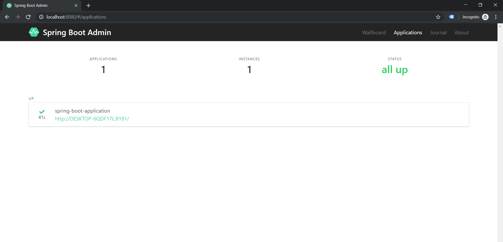
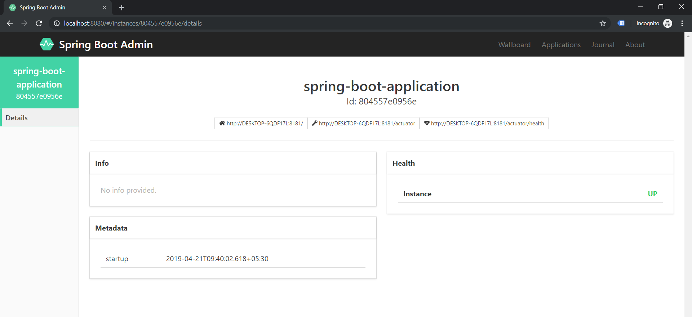

# Spring boot admin UI example

## Checkout Repository
``` sh
git clone https://github.com/subhashlamba/spring-examples.git
cd spring-boot-admin-ui-example
```

## Build and Run application

``` sh
mvn clean install -f .\spring-boot-admin-ui-application\pom.xml 
mvn clean install -f .\spring-boot-client-application\pom.xml 

START "" java -jar spring-boot-admin-ui-application/target/spring-boot-admin-ui-example-1.0-SNAPSHOT.jar 
START "" java -jar spring-boot-client-application/target/spring-boot-client-application-1.0-SNAPSHOT.jar
```

## Open admin UI

http://localhost:8080/

### Admin UI



### Admin - Application Details




